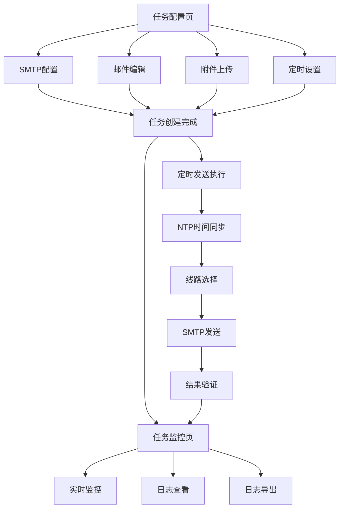

# 投标邮件极速发送系统 - 产品需求文档

## 1. 产品概述

投标邮件极速发送系统是一款专为招投标场景设计的自动化邮件发送工具，通过毫秒级精准定时发送、多线路冗余机制和邮件预加载技术，确保投标邮件在截止时间前以最优速度投递至发行人邮箱，最大化提升分标排序优先级。

目标用户：参与各类招投标项目的企业投标专员、采购人员。
核心价值：解决人工发送邮件的网络延迟和操作耗时问题，将邮件到达时间精度控制在毫秒级，显著提高中标概率。

## 2. 核心功能

### 2.1 用户角色

| 角色 | 注册方式 | 核心权限 |
|------|----------|----------|
| 系统管理员 | 本地配置 | 配置SMTP服务器、设置全局参数、查看所有日志 |
| 投标操作员 | 本地账户 | 创建发送任务、监控发送状态、导出日志 |

### 2.2 功能模块

本系统包含以下核心页面：

1. **任务配置页**：SMTP服务器配置、邮件内容编辑、附件上传、发送时间设定。
2. **任务监控页**：发送任务列表、实时状态监控、发送日志查看、日志导出。
3. **系统设置页**：时间同步配置、线路管理、安全设置、全局参数调整。

### 2.3 页面详情

| 页面名称 | 模块名称 | 功能描述 |
|----------|----------|----------|
| 任务配置页 | SMTP配置模块 | 配置多个SMTP服务器地址、端口、加密方式、认证信息（AES-256加密存储）。 |
| 任务配置页 | 邮件编辑模块 | 编辑邮件标题（自动附加UUID防重放）、正文内容、支持富文本格式。 |
| 任务配置页 | 附件管理模块 | 上传投标附件、自动计算MD5校验值、预加载至内存、显示文件大小。 |
| 任务配置页 | 定时设置模块 | 设置精确到毫秒的发送时间、配置提前启动量（默认100ms）、选择发送线路策略。 |
| 任务监控页 | 任务列表模块 | 显示所有发送任务的状态（待发送、发送中、成功、失败）、预设时间、优先级。 |
| 任务监控页 | 实时监控模块 | 实时显示当前任务的发送进度、线路选择、响应状态、已用时间。 |
| 任务监控页 | 日志查看模块 | 查看详细发送日志（预设时间、实际发送时间、服务器响应时间、响应码、附件大小）。 |
| 任务监控页 | 日志导出模块 | 将日志导出为CSV格式，支持按时间范围筛选。 |
| 系统设置页 | 时间同步模块 | 配置NTP服务器地址、设置同步间隔（默认每小时）、查看上次同步时间、同步失败告警。 |
| 系统设置页 | 线路管理模块 | 添加/删除SMTP线路、测试线路延迟、设置线路优先级、配置故障切换策略。 |
| 系统设置页 | 安全配置模块 | 修改加密密钥、配置密码策略、查看安全日志。 |

## 3. 核心流程

### 3.1 发送任务创建流程

用户进入任务配置页，依次完成SMTP服务器配置、邮件内容编辑、附件上传、定时设置。系统对附件进行MD5校验并将邮件内容预加载至内存。用户确认后，任务进入待发送队列。

### 3.2 定时发送执行流程

系统通过NTP同步确保时间精度，在预设时间前100ms启动发送流程。自动选择延迟最低的SMTP线路，建立socket直连连接，发送邮件并实时监控"250 OK"响应。若主线路失败，0ms切换至备用线路重试（最多3次）。

### 3.3 监控与日志流程

发送过程中实时更新任务状态，记录发送时间戳、响应状态、线路信息。用户可在任务监控页查看实时状态和详细日志，支持导出CSV格式日志用于后续分析。

## 4. 用户界面设计

### 4.1 设计风格

- **主色调**：深蓝色（#1e3a5f）作为主色，橙色（#ff6b35）作为强调色，灰色（#f5f5f5）作为背景色
- **按钮样式**：扁平化设计，圆角4px，主按钮使用橙色渐变，次按钮使用灰色边框
- **字体**：系统默认无衬线字体，标题16-18px，正文14px，辅助信息12px
- **布局风格**：左侧导航栏+右侧内容区的经典管理后台布局，卡片式信息组织
- **图标风格**：使用线性图标，保持简洁专业风格

### 4.2 页面设计概述

| 页面名称 | 模块名称 | UI元素 |
|----------|----------|--------|
| 任务配置页 | SMTP配置 | 表单输入框（服务器地址、端口、用户名、密码）、下拉选择（加密方式）、测试连接按钮 |
| 任务配置页 | 邮件编辑 | 富文本编辑器、标题输入框、UUID显示区域（只读）、字符计数器 |
| 任务配置页 | 附件管理 | 文件上传拖拽区、文件列表（含文件名、大小、MD5值）、删除按钮 |
| 任务配置页 | 定时设置 | 时间选择器（精确到毫秒）、数字输入框（提前量）、线路策略单选按钮组 |
| 任务监控页 | 任务列表 | 表格（状态标签、时间、优先级）、分页器、筛选器、刷新按钮 |
| 任务监控页 | 实时监控 | 进度条、状态指示器（彩色圆点）、实时数据卡片、线路信息展示 |
| 任务监控页 | 日志查看 | 可滚动日志列表、时间戳格式化显示、详情展开/收起 |
| 任务监控页 | 日志导出 | 日期范围选择器、导出按钮、格式选择（CSV） |
| 系统设置页 | 时间同步 | NTP服务器输入框、同步间隔滑块、上次同步时间显示、同步状态指示器 |
| 系统设置页 | 线路管理 | 线路列表表格、延迟测试按钮、优先级拖拽排序、故障切换开关 |

### 4.3 响应式设计

本系统采用桌面优先设计策略，主要面向Windows和Linux桌面环境使用。界面最小支持1280x720分辨率，推荐1920x1080分辨率。考虑到专业使用场景，暂不提供移动端适配。

## 5. 性能需求

| 指标 | 要求 |
|------|------|
| 发送延迟 | 从触发发送到SMTP服务器接收到完整邮件的时间≤50ms（含网络传输） |
| 时间精度 | 发送时间与预设时间误差≤10ms |
| 并发能力 | 支持同时向多个邮箱发送，单线程发送间隔≤10ms |
| 时间同步精度 | 本地时间与标准时间误差≤10ms |
| 线路切换延迟 | 主线路失败时，切换至备用线路延迟=0ms |

## 6. 安全需求

| 安全项 | 要求 |
|--------|------|
| 认证信息加密 | SMTP账号密码使用AES-256加密存储，运行时动态解密 |
| 防重放攻击 | 邮件标题自动附加UUID唯一随机字符串 |
| 附件完整性 | 发送前校验附件MD5值，确保文件未损坏 |
| 传输安全 | 支持SSL/TLS加密传输（端口465/587） |
| 配置文件保护 | 配置文件设置合理权限，禁止非授权访问 |

## 7. 部署环境要求

| 项目 | 要求 |
|------|------|
| 操作系统 | Windows 10/11 或 Linux（Ubuntu 20.04+） |
| 编程语言 | Python 3.8+ |
| 依赖库 | smtplib、ntplib、cryptography、socket、logging |
| 网络要求 | 固定公网IP（避免NAT延迟），带宽≥1Mbps |
| 硬件要求 | CPU≥2核，内存≥4GB，磁盘≥10GB |

## 8. 测试验收标准

### 8.1 时间精度测试

连续进行10次发送测试，记录预设时间与实际服务器接收时间，计算误差均方根（RMS），要求RMS≤10ms。

### 8.2 压力测试

模拟网络波动环境（延迟50-200ms），测试系统自动切换线路能力，要求发送成功率≥99%。

### 8.3 验收指标

在发行人测试邮箱中验证，邮件接收时间戳与预设时间误差≤20ms视为合格。提供包含10次发送时间误差数据的测试报告。

### 8.4 交付物清单

| 交付物 | 说明 |
|--------|------|
| 可执行脚本 | .py文件或.exe打包文件 |
| 配置文件模板 | 含SMTP服务器地址、账号密码加密字段 |
| 使用手册 | 含时间同步设置、发送日志查看方法 |
| 测试报告 | 含10次发送的时间误差数据 |
