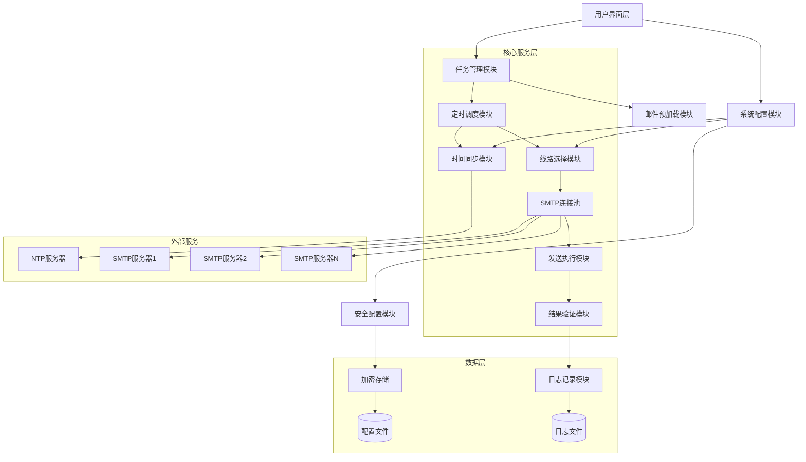
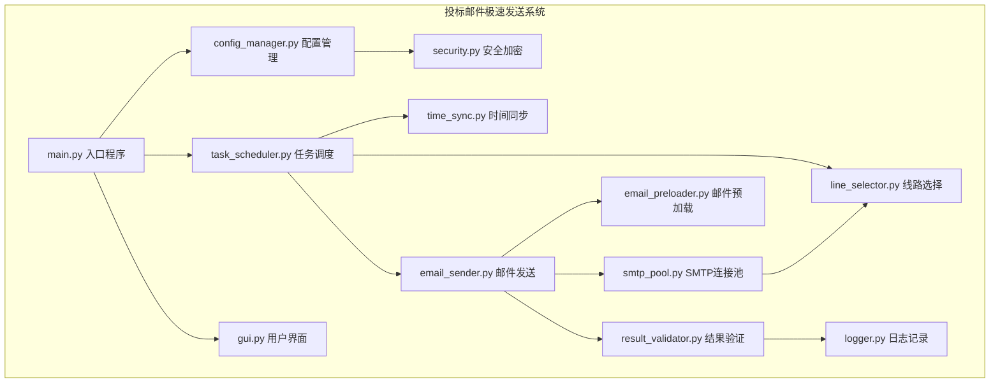
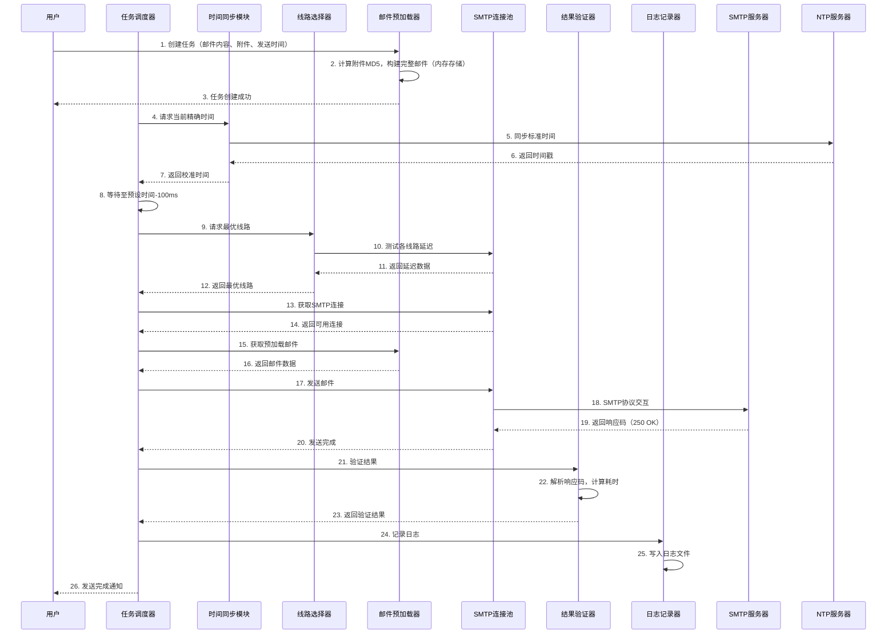

# 投标邮件极速发送系统 - 技术架构文档

## 1. 架构设计



## 2. 技术描述

- **开发语言**: Python 3.8+
- **核心库**: 
  - smtplib（SMTP协议实现）
  - ntplib（NTP时间同步）
  - cryptography（AES-256加密）
  - socket（底层网络连接）
  - threading（并发控制）
  - logging（日志记录）
  - hashlib（MD5校验）
  - uuid（防重放攻击）
  - configparser（配置文件管理）
  - tkinter/PyQt5（可选GUI界面）
- **部署方式**: 命令行脚本或打包为可执行文件
- **操作系统**: Windows 10/11、Linux（Ubuntu 20.04+）

## 3. 核心模块设计

### 3.1 模块结构图



### 3.2 核心模块说明

| 模块名称 | 文件 | 功能描述 |
|----------|------|----------|
| 配置管理 | config_manager.py | 读取/写入配置文件，管理SMTP服务器配置、全局参数，支持AES-256加密存储敏感信息 |
| 时间同步 | time_sync.py | NTP客户端实现，每小时自动同步标准时间，计算本地时间与标准时间的偏移量 |
| 邮件预加载 | email_preloader.py | 提前构建完整邮件内容（含标题、正文、附件），存储于内存，计算附件MD5校验值 |
| SMTP连接池 | smtp_pool.py | 维护多个SMTP服务器的长连接，支持连接预热和保活，减少连接建立时间 |
| 线路选择 | line_selector.py | 实时测试各线路延迟，选择最优线路，实现故障自动切换逻辑 |
| 任务调度 | task_scheduler.py | 高精度定时器，支持毫秒级调度，在预设时间前提前启动发送流程 |
| 邮件发送 | email_sender.py | 通过socket直连SMTP服务器，发送预加载的邮件内容，处理SMTP协议交互 |
| 结果验证 | result_validator.py | 解析SMTP服务器响应，验证"250 OK"状态码，计算发送耗时 |
| 日志记录 | logger.py | 记录发送日志，支持CSV格式导出，包含时间戳、响应状态、线路信息 |
| 安全加密 | security.py | AES-256加密/解密，UUID生成，MD5计算 |
| 用户界面 | gui.py | 可选的图形界面，提供任务配置、监控、日志查看功能 |

## 4. 数据流设计



## 5. 配置文件结构

### 5.1 配置文件示例

```ini
[global]
; 全局设置
ntp_server = cn.pool.ntp.org
sync_interval = 3600
log_level = INFO
log_path = ./logs/

[security]
; 安全设置
encryption_key = your-32-byte-key-here
uuid_enabled = true
md5_check = true

[scheduler]
; 调度设置
advance_ms = 100
retry_count = 3
retry_interval_ms = 0

[smtp_primary]
; 主SMTP服务器
host = smtp.example.com
port = 465
username = user@example.com
password = ENC:encrypted_password_here
use_ssl = true
timeout = 5
priority = 1

[smtp_backup1]
; 备用SMTP服务器1
host = smtp.backup1.com
port = 587
username = backup1@example.com
password = ENC:encrypted_password_here
use_tls = true
timeout = 5
priority = 2

[smtp_backup2]
; 备用SMTP服务器2
host = smtp.backup2.com
port = 25
username = backup2@example.com
password = ENC:encrypted_password_here
use_ssl = false
timeout = 5
priority = 3
```

### 5.2 配置项说明

| 配置节 | 配置项 | 说明 |
|--------|--------|------|
| global | ntp_server | NTP服务器地址 |
| global | sync_interval | 时间同步间隔（秒） |
| global | log_level | 日志级别 |
| global | log_path | 日志文件路径 |
| security | encryption_key | AES-256加密密钥 |
| security | uuid_enabled | 是否启用UUID防重放 |
| security | md5_check | 是否启用MD5校验 |
| scheduler | advance_ms | 提前启动时间（毫秒） |
| scheduler | retry_count | 失败重试次数 |
| scheduler | retry_interval_ms | 重试间隔（毫秒） |
| smtp_* | host | SMTP服务器地址 |
| smtp_* | port | SMTP端口 |
| smtp_* | username | 登录账号 |
| smtp_* | password | 加密后的密码 |
| smtp_* | use_ssl | 是否使用SSL |
| smtp_* | use_tls | 是否使用TLS |
| smtp_* | timeout | 连接超时时间（秒） |
| smtp_* | priority | 线路优先级 |

## 6. 日志与监控设计

### 6.1 日志格式

```
[时间戳] [级别] [模块] [任务ID] 消息内容
```

### 6.2 发送日志字段

| 字段名 | 类型 | 说明 |
|--------|------|------|
| task_id | string | 任务唯一标识 |
| preset_time | datetime | 预设发送时间 |
| actual_send_time | datetime | 实际发送时间 |
| server_receive_time | datetime | 服务器接收时间（如有） |
| response_code | string | SMTP响应码 |
| response_message | string | SMTP响应消息 |
| line_used | string | 使用的线路名称 |
| attachment_size | int | 附件大小（字节） |
| attachment_md5 | string | 附件MD5值 |
| duration_ms | float | 发送耗时（毫秒） |
| error_message | string | 错误信息（如有） |

### 6.3 监控指标

| 指标 | 说明 |
|------|------|
| 任务队列长度 | 当前待发送任务数量 |
| 发送成功率 | 成功发送数/总发送数 |
| 平均发送延迟 | 所有发送任务的平均耗时 |
| 线路延迟 | 各SMTP线路的实时延迟 |
| 时间同步偏移 | 本地时间与NTP时间的偏移量 |

### 6.4 告警机制

| 告警类型 | 触发条件 | 处理方式 |
|----------|----------|----------|
| 时间同步失败 | NTP同步失败 | 记录日志，尝试备用NTP服务器 |
| 线路故障 | SMTP连接失败 | 自动切换线路，记录故障 |
| 发送失败 | 重试次数用尽 | 记录错误，标记任务失败 |
| 配置错误 | 配置文件格式错误 | 启动时检查，输出错误信息 |

## 7. 关键算法设计

### 7.1 高精度定时算法

```python
# 伪代码
def precise_sleep(target_time, advance_ms=100):
    """高精度等待至目标时间"""
    wake_time = target_time - timedelta(milliseconds=advance_ms)
    
    # 粗略等待
    while current_time() < wake_time:
        sleep(1)  # 1秒间隔
    
    # 精细忙等待
    while current_time() < target_time:
        pass  # 忙等待确保精度
```

### 7.2 线路选择算法

```python
# 伪代码
def select_best_line(lines):
    """选择延迟最低的可用线路"""
    available_lines = []
    
    for line in lines:
        latency = test_latency(line)
        if latency is not None:
            available_lines.append((line, latency))
    
    if not available_lines:
        raise NoAvailableLineError()
    
    # 按延迟排序，选择最低延迟线路
    available_lines.sort(key=lambda x: x[1])
    return available_lines[0][0]
```

### 7.3 故障切换算法

```python
# 伪代码
def send_with_failover(email, lines, max_retry=3):
    """带故障切换的发送"""
    for attempt in range(max_retry):
        line = select_best_line(lines)
        try:
            result = send_email(email, line)
            if result.success:
                return result
        except Exception as e:
            mark_line_failed(line)
            continue
    
    raise SendFailedError("All lines failed")
```

## 8. 性能优化策略

| 优化点 | 策略 |
|--------|------|
| 连接预热 | 系统启动时预先建立SMTP连接，避免发送时建立连接的开销 |
| 内存缓存 | 邮件内容预加载至内存，避免磁盘IO延迟 |
| 忙等待优化 | 最后几毫秒使用忙等待而非sleep，提高时间精度 |
| 连接复用 | 使用连接池复用SMTP连接，减少TCP握手时间 |
| 异步测试 | 线路延迟测试使用异步并发，减少测试时间 |
| 零拷贝发送 | 直接使用内存中的邮件数据，避免数据拷贝 |
